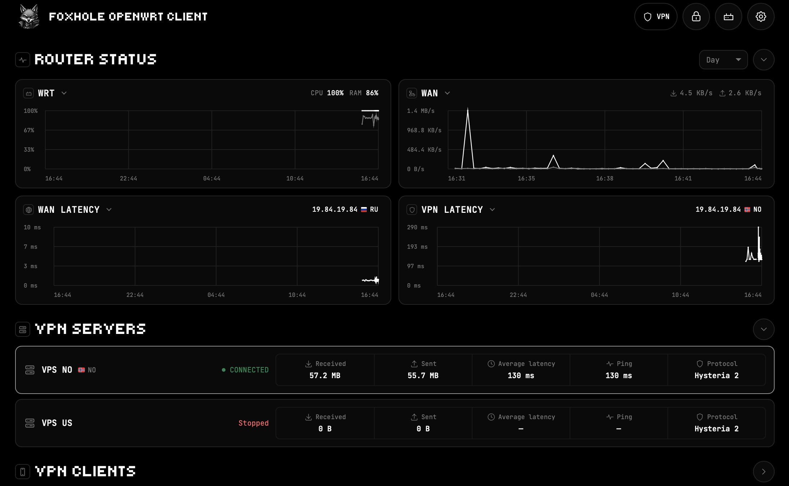

<p align="center">
  
</p>

<p align="center">
  <a href="README.md"></a>
  <a href="docs/README.ru.md"></a>
</p>

<p align="center">
  <a href="https://github.com/foxhole-team/foxhole-openwrt-client/releases"></a>
</p>

# FoxHole OpenWrt Client


[](LICENSE)

**FoxHole OpenWrt Client** provides a Hysteria 2 tunnel, routing policy and a
LuCI management panel for OpenWrt routers. It runs upstream Hysteria
independently of FoxHole Core and FoxHole DB. This is a prototype under
development.

## Capabilities

| Component | Function |
| --- | --- |
| Tunnel | Supervised Hysteria 2 TUN; profile import as URI or JSON. |
| Routing | Device, domain and country rules; direct/VPN paths and LAN kill switch. |
| Incoming VPN | Optional Hysteria listeners with credentials and LAN access policy. |
| Monitoring | Traffic, CPU, RAM, WAN/VPN latency and 30-day local history. |
| Interface | LuCI and standalone panel; English and Russian. |



The retained reference screenshot predates the CPU calculation fix; its
readings are not measurements of the current build.

## Installation

Target: **OpenWrt 25.12.x, ARM64, `aarch64_generic`, APK**. Run as root over
LAN with HTTPS downloads available. The installer authenticates and installs
the pinned FoxHole APK public key before adding packages.

One-command installation from GitHub, **after a signed release is published**:
replace `RELEASE_TAG` and `MANIFEST_SHA256` with the reviewed tag and the
independently authenticated SHA-256 of its `SHA256SUMS`. The embedded hash
pins this installer before execution; APK hashes come from that manifest.
The public key has a separate embedded SHA-256 pin. Every APK signature is
verified before installation; normal installation needs no trust bypass.

```sh
(set -eu; url='https://github.com/foxhole-team/foxhole-openwrt-client/releases/download/RELEASE_TAG'; f=$(mktemp /tmp/foxhole-install.XXXXXX); trap 'rm -f "$f"' EXIT; uclient-fetch -q -T 60 -O "$f" "$url/install.sh"; printf '%s  %s\n' '0ef98c75377112087ef1c33e4cf5ec1521300bf3d0b9cf39bddff2238a9d6bf8' "$f" | sha256sum -c -; sh "$f" --base-url "$url" --manifest-sha256 MANIFEST_SHA256 --apply)
```

| Storage | Free overlay | Available RAM | Reboot behavior |
| --- | ---: | ---: | --- |
| Flash, default | 32 MiB | 48 MiB | Engine persists. |
| `--ram` | 4 MiB | 96 MiB | Engine downloads again with a pinned checksum. |

These are installation thresholds. Settings stay on flash in both modes;
there is no automatic fallback. Remove `--apply` for validation: it updates
APK indexes and simulates dependencies without installing packages.
See [CLI commands](docs/CLI.md), [release procedure](docs/RELEASE.md)
and [rollback](docs/ROLLBACK.md).

## Operation and limits

Open **LuCI → Services → FoxHole**, replace the initial `1234` PIN and import
a server profile. Installation also makes the panel the default web index.
Keep web/SSH management on trusted LANs. [Configuration templates](examples/)
contain inactive placeholders.

- Incoming users require TLS provisioning and a reachable UDP endpoint.
  Shared UDP/443 has one LAN ACL; separate user ACLs require separate ports.
  **Incoming users exit directly when the upstream VPN is disconnected.**
  The LAN kill switch is a separate policy.
- Domain classification depends on observed DNS; encrypted DNS and shared
  addresses limit accuracy. WAN latency measures the gateway; VPN latency
  measures a tunneled HTTPS request, including connection setup overhead.
- History runs without the panel. Hourly flash checkpoints can lose up to
  an hour on power loss.

## Development and CI

Node 22+, Python 3.11+ and Gitleaks 8.30.1:

```sh
npm ci --ignore-scripts
npm run check
npm run build:source
```

No frontend npm dependencies are required. GitHub Actions checks push/PR
changes and builds unsigned APKs after successful `dev` checks. Signed
`main` accepts a successful `dev` candidate with identical source files.
Main automatically prepares a release draft. APK signatures and owner GPG
release signatures are made locally. See [checks, build and release](docs/RELEASE.md),
[CLI](docs/CLI.md) and [architecture with two diagrams](docs/ARCHITECTURE.md).

---

[Security](SECURITY.md) · [Changelog](CHANGELOG.md) · [Third-party notices](THIRD_PARTY_NOTICES.md)

FoxHole: [Android](https://github.com/foxhole-team/foxhole-guard) ·
[Core](https://github.com/foxhole-team/foxhole-core) ·
[Data](https://github.com/foxhole-team/foxhole-db)
