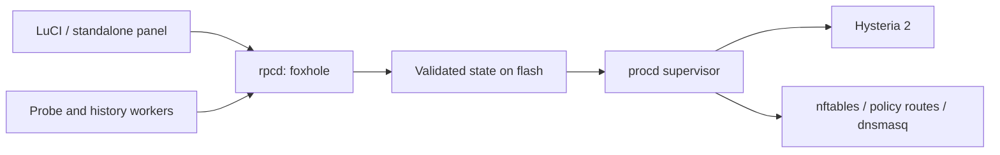
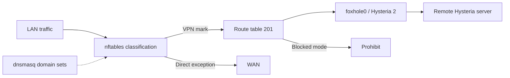

# Architecture

The control plane uses LuCI, rpcd and ucode; Hysteria 2 owns the tunnel.
FoxHole Core and the signed FoxHole DB feeds are separate projects.

## Control plane

RPC validates input and state revisions, then replaces state under a lock.
The supervisor starts Hysteria, waits for `foxhole0` and a successful HTTPS
probe through Hysteria's local HTTP proxy, applies policy, and reports
`connected`. Exit removes the runtime credential file and applies the
configured block/off policy. This probe does not establish LAN acceptance.

## Traffic paths

Reserved networks bypass classification. Device-direct rules precede
scoped site/country rules; site-VPN precedes site-direct, then country-direct.
Remaining scoped traffic uses VPN. The egress guard drops VPN-marked
packets that would leave outside the TUN.

Incoming users use a separate Hysteria ACL: permitted LAN ranges, private
range rejection, then country exceptions/upstream when client rules and VPN
are active; otherwise direct egress. Shared UDP/443 permits 32 users with
one LAN policy; separate listeners permit four users with individual ports.

Country prefixes come from `ipverse/country-ip-blocks`; IP probes use
Cloudflare trace. Profiles and authentication are stored under
`/etc/foxhole`; runtime files and history use `/tmp/foxhole`. Thirty-day
history is checkpointed hourly to flash.

## Source references

| Contract | Implementation |
| --- | --- |
| State, authentication, RPC | [foxhole.uc](../package/foxhole-openwrt-client/root/usr/share/rpcd/ucode/foxhole.uc) |
| Start, probe, exit | [supervisor](../package/foxhole-openwrt-client/root/usr/libexec/foxhole-supervisor), [runtime](../package/foxhole-openwrt-client/root/usr/libexec/foxhole-runtime) |
| Routing precedence | [runtime-model.uc](../package/foxhole-openwrt-client/root/usr/share/foxhole/runtime-model.uc) |
| Incoming users | [inbound.uc](../package/foxhole-openwrt-client/root/usr/share/foxhole/inbound.uc) |
| Sampling and retention | [probe](../package/foxhole-openwrt-client/root/usr/libexec/foxhole-probe), [history.uc](../package/foxhole-openwrt-client/root/usr/share/foxhole/history.uc) |

Known limits: DNS classification is approximate; incoming-user direct
fallback is independent of the LAN kill switch; device/load acceptance
remains a [release gate](RELEASE.md).
